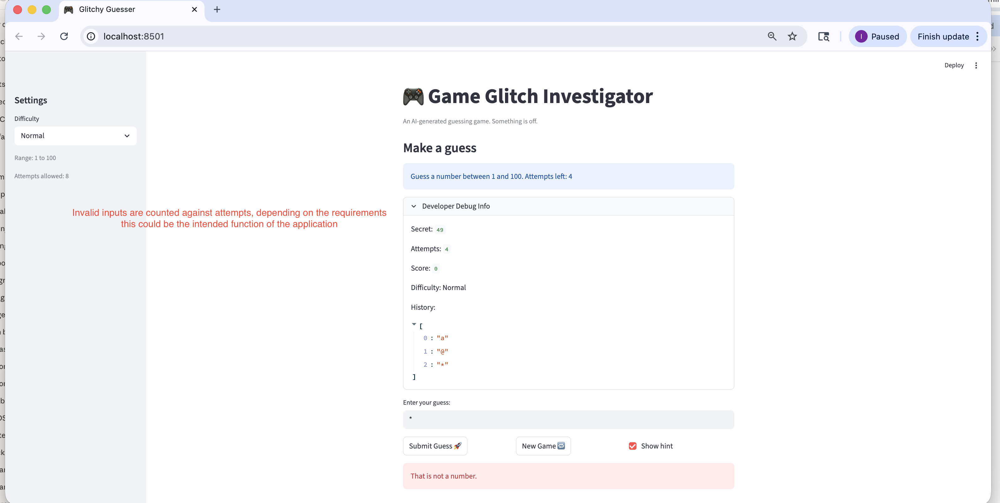
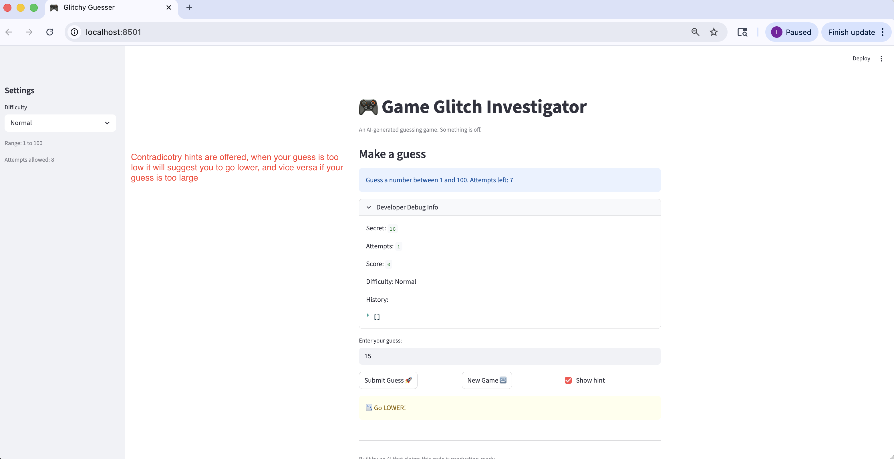
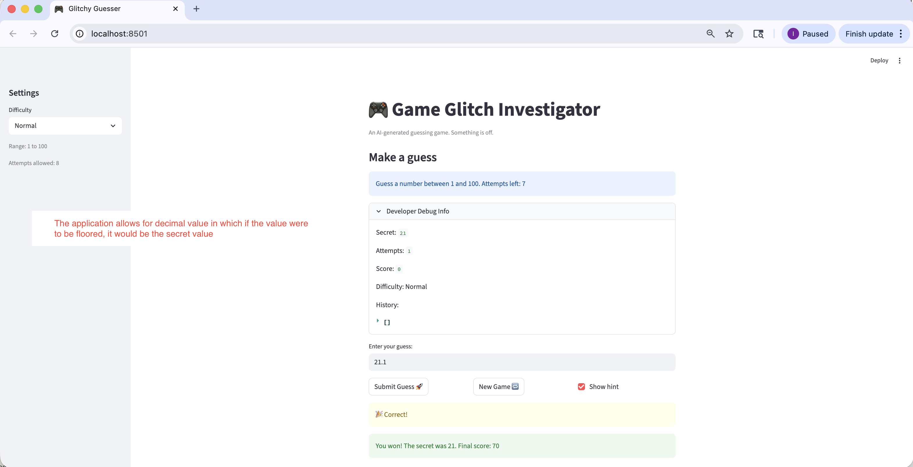
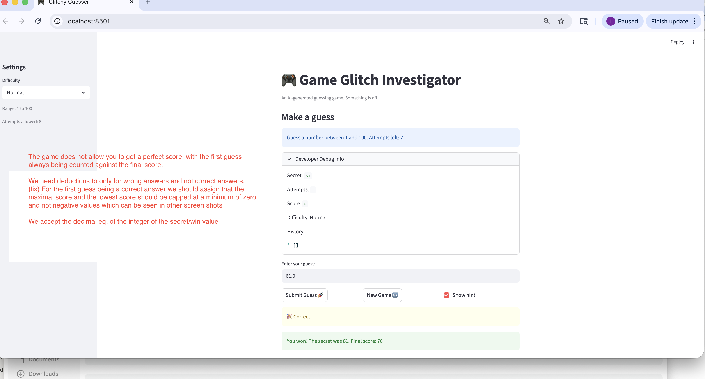
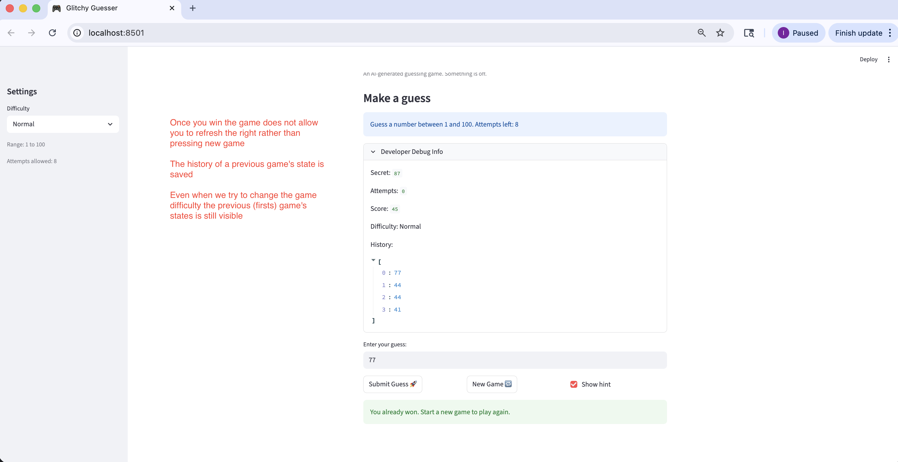

# Game Glitch Investigator: The Impossible Guesser

## The Situation

You asked an AI to build a simple "Number Guessing Game" using Streamlit.
It wrote the code, ran away, and now the game is unplayable.

- You can't win.
- The hints lie to you.
- The secret number seems to have commitment issues.

## Setup

1. Install dependencies: `pip install -r requirements.txt`
2. Run the broken app: `python -m streamlit run app.py`

## Your Mission

1. **Play the game.** Open the "Developer Debug Info" tab in the app to see the secret number. Try to win.
2. **Find the State Bug.** Why does the secret number change every time you click "Submit"? Ask ChatGPT: *"How do I keep a variable from resetting in Streamlit when I click a button?"*
3. **Fix the Logic.** The hints ("Higher/Lower") are wrong. Fix them.
4. **Refactor & Test.** - Move the logic into `logic_utils.py`.
   - Run `pytest` in your terminal.
   - Keep fixing until all tests pass!

## Document Your Experience

**Game Purpose:**
A number guessing game where the player tries to guess a randomly generated secret number within a difficulty-based range. The player receives directional hints after each guess and earns points based on how quickly they find the correct answer.

**Bugs Found:**

1. **Inverted hints** — `check_guess()` in `logic_utils.py` returned "Go HIGHER!" when the guess was too high and "Go LOWER!" when too low, the exact opposite of what the player needs.
2. **Score deducted on first correct guess** — `update_score()` applied a deduction before checking if the outcome was a win, so even a first-attempt correct guess lost 5 points instead of awarding 100.
3. **Attempts incremented before input validation** — `st.session_state.attempts += 1` ran before `parse_guess()` was called in `app.py`, so blank or non-numeric input still consumed an attempt.
4. **Decimal inputs accepted as correct** — `parse_guess()` floored decimal values (e.g., `42.9` -> `42`), allowing decimals that rounded to the secret number to count as wins.
5. **Game state not cleared on new game / difficulty change** — guess history and score from the previous round persisted when starting a new game or switching difficulty.

**Fixes Applied:**

- Swapped the "Too High" / "Too Low" hint strings in `check_guess()` so they correctly guide the player.
- Moved the attempt increment inside the valid-guess branch so invalid input no longer costs an attempt.
- Updated `update_score()` to award points immediately on a win without first deducting, and added a floor of 0 so scores cannot go negative.
- Added a strict integer check in `parse_guess()` to reject any input containing a decimal point as invalid rather than flooring it.
- Added session-state resets for history, attempts, and score when "New Game" is clicked or difficulty changes.

## Demo

### Bug 1 — Invalid input consumes an attempt
Non-numeric input (e.g. `*`) triggers "That is not a number." but still decrements the attempt counter. The history array fills with empty strings `""` for each invalid submission.

---

### Bug 2 — Inverted hints
Secret is `16`, player guesses `15` (too low), but the game says **"Go LOWER!"** — the exact opposite of the correct direction.

---

### Bug 3 — Decimal inputs accepted as a win
Player enters `21.1` when the secret is `21`. The floor logic silently converts it to `21` and awards a win, bypassing the integer-only requirement.

---

### Bug 4 — Score deducted on first correct guess
A first-attempt correct guess should score `100`, but the deduction runs before the win check, resulting in a score of `70` instead.

---

### Bug 5 — Game state not cleared on new game
After winning, clicking "New Game" does not reset guess history. The previous round's guesses remain visible alongside the new game's state.

---

### Fixed — Clean win after all bugs resolved
All five bugs fixed: hints are correct, score awards `100` on a first-attempt win (or decrements correctly on subsequent attempts), invalid input is rejected without costing an attempt, decimals are rejected, and state resets cleanly on new game.

## Stretch Features

- [x] **pytest test suite** — `tests/test_game_logic.py` covers `parse_guess`, `check_guess`, `update_score`, and `get_range_for_difficulty` with edge-case tests (first-attempt win, decimal rejection, invalid input, score floor at zero).
